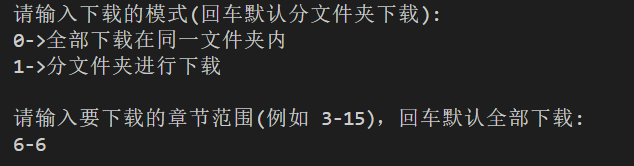
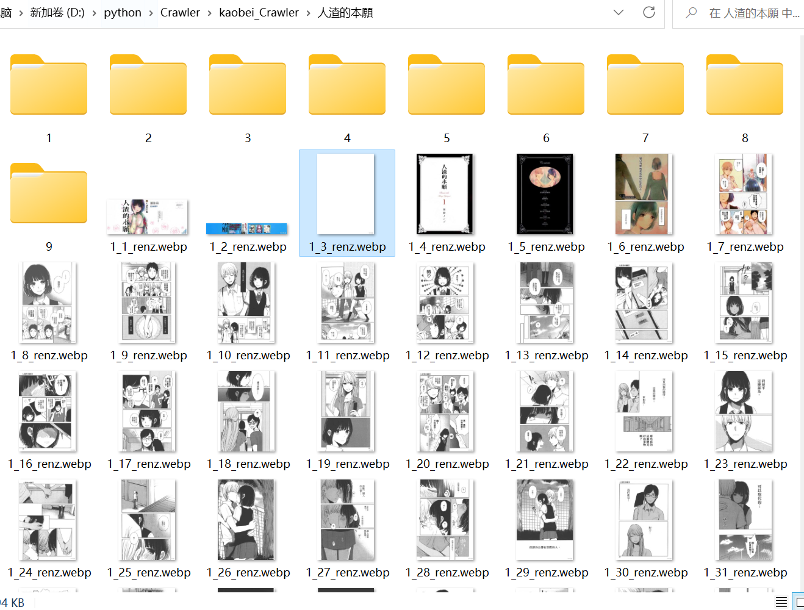
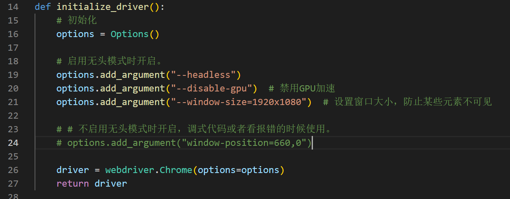

# kaobei_Crawler
主要使用selenium库模拟浏览器来获取kaobei动态加载的html页面,用BeautifulSoup进行解析。然后传入函数先获取url,开启一个线程使用selenium启动无头浏览器访问url并依次获取图片下载链接,把链接存入队列。使用另一个线程从队列中取出链接并下载图片。

拷贝主页为<https://www.mangacopy.com/>

下面是使用方法。
---

## kaobei_spider_1.py

运行`kaobei_spider_1.py`

输入你想要的效果就行了，其中下面如果要单章下载，比如输入6-6就可以只下载第6章，其他的范围比如3-15，就是下载第3章到第15章的漫画。格式输正确了就行。

下图前面的文件夹是1的效果，在外面的图片是0的效果。文件名已经改掉了，现在变得更简单了，可能图文不符，不用在意。

使用临时账号和密码登陆，需要登陆的原因是有一些漫画不登陆不可见
(在52和53行处,可以不用修改 也可以修改成你的账号和密码)

### 在`kaobei_spider_1.py`第19行处修改漫画页面的url，修改成页面显示如下图时的url。从浏览器复制就行。

下载的图片新存放于本文件夹中的新建获取网页漫画名的文件夹中。

---

## 最后是一些注意事项
1. 可能需要开梯子才能正确下载，我换了梯子后可以完美正常下载，不开梯子可能会有报错。和拷贝服务器有关系吧。

2. 大量下载可能会导致部分漫画连接错误，可以多运行程序几次，重复图片不会再次下载，可以补全之前连接错误没能下载的图片。

3. `file_in.py`和`file_out.py` 是用来快速把图片移到同一个文件夹和移到文件夹里面的文件，注意修改`main_folder`的值就可以了，改成你下载的漫画文件夹的名称

4. 如果有报错不知道咋回事，可以把`manga_downloader.py`中18行左右位置处，无头浏览器的注释去掉，打开下面不启用无头浏览器的模式，然后根据浏览器的页面查看哪里出了问题。(目前遇到的大部分问题都是网络)

5. `download_file.py`第十行可以修改最大线程数，就是数量越大下得越快，但是要注意网速，太快了连接会报错哦~

6. 因为每章漫画的页数不同，所以为了便于下载。可以提前修改`count`的值(`manga_downloader.py`第110行)，不知道啥意思默认就行，改不改影响都不大。 

    页数<60时，使用默认值count=4 

    页数60<i<120 ，可修改count=8

    页数>200，可修改count=16

---

~~## kaobei_spider_2.py~~

~~### 在41行处修改漫画页面的url~~

~~使用的是本机浏览器，例如代码中的Chrome浏览器,如果你的浏览器中已经登陆了拷贝网站，那么就可以省去登陆的步骤。~~

~~但是配置起来比较麻烦(不推荐使用,后续更新也暂不考虑此处)，教程见[教程](https://blog.csdn.net/beckynie1989/article/details/124262163)<https://blog.csdn.net/beckynie1989/article/details/124262163>~~

~~使用前需要关闭所有浏览器页面    然后打开终端输入    Chrome --remote-debugging-port=9222~~

~~建议直接使用kaobei_spider_1的账号密码登陆~~

此文件不再更新维护，仅供参考。