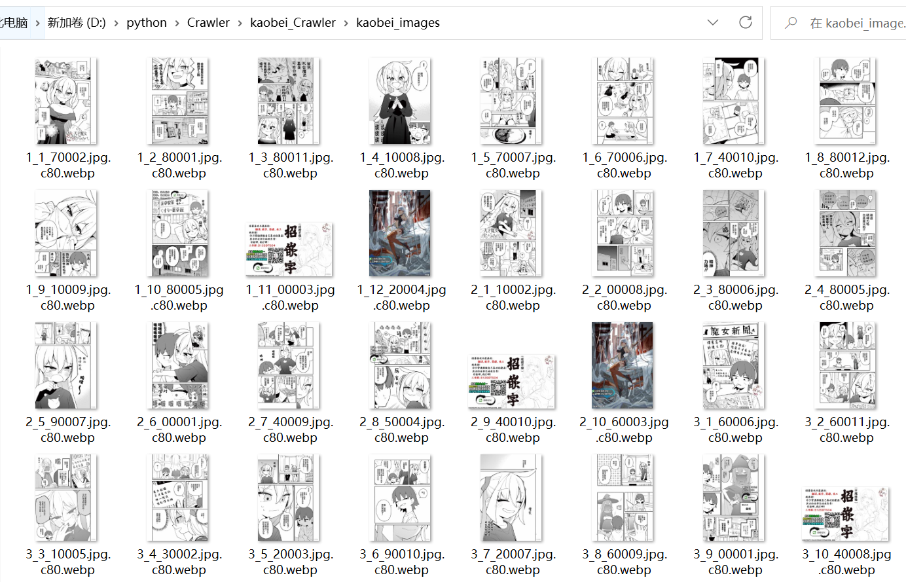

# kaobei_Crawler
主要使用selenium库模拟浏览器来获取kaobei动态加载的html页面。

用BeautifulSoup进行解析。然后传入函数先获取url。

将url传入get.py中使用多线程编程加快下载速率

下面是具体函数及使用方法。

download.py 和 get.py 是方法函数，不需要修改。pic是md图片存放处。

---

## kaobei_spider_1.py
使用临时账号和密码登陆，需要登陆的原因是有一些漫画不登陆不可见
(在50和51行处,可以不用修改 也可以修改成你的账号和密码)

### 56行处修改漫画页面的url，修改成页面显示如下图时的url。从浏览器复制就行。

下载的图片新存放于本文件夹中的一个kaobei_images中。

---

## kaobei_spider_2.py
使用的是本机浏览器，例如代码中的Chrome浏览器
如果你的浏览器中已经登陆了拷贝网站，那么就可以省去登陆的步骤。

但是配置起来比较麻烦，教程见[教程](https://blog.csdn.net/beckynie1989/article/details/124262163)<https://blog.csdn.net/beckynie1989/article/details/124262163>

建议直接使用kaobei_spider_1的账号密码登陆

---

## 最后是一些注意事项
1. 由于使用多线程下载，对每张图片使用一个新的线程进行下载。所以可能会比较吃网速，导致一些报错。如果出现这种情况，可以如下解决。
   1. 一次运行完后，再次运行py程序，因为图片会先检测是否存在，不会重复下载。基本多运行几次就可以完全下载。
   2. 取消get.py第20行的注释，让所有下载图像的线程创建完成后停一秒后再返回，时间也可以多加一些。

   
2. 程序运行时请让浏览器的页面保持在屏幕中，不要最小化到任务栏中，不然页面不会进行更新。

3. kaobei_spider_2.py目前运行完成后不能自动关闭，需要手动结束一下进程。当然最好等一会，因为打印出最后下载章数的时候，可能还有一些下载图片的进程在运行。

4. 下载的漫画全部存放于一个文件夹中，文件名格式由章节数_图片顺序_url中部分字符串构成。如下所示。
